# 🚗 California Traffic Collision Data Analysis using PySpark

**Enterprise-Grade Distributed Data Pipeline for Large-Scale Traffic Safety Analytics**


---

## 📊 Executive Summary

This comprehensive analysis processes **980,364 California traffic collisions** from 2001-2020, generating actionable insights for urban planners, policy makers, and transportation authorities. Using Apache Spark, we've analyzed millions of records to identify patterns, risk factors, and intervention opportunities that can save lives.

### 🎯 Key Findings at a Glance

```
╔═══════════════════════════════════════════════════════════════════╗
║                    COLLISION STATISTICS                           ║
╠═══════════════════════════════════════════════════════════════════╣
║  Total Collisions          │ 980,364        │ 20 years of data    ║
║  Total Injuries            │ 375,397 (38%)  │ Must reduce         ║
║  Severe Injuries           │ 22,756 (2.4%)  │ Critical focus      ║
║  Peak Year                 │ 2002 (54,957)  │ High-risk period    ║
║  Recent Year (2020)        │ 36,588         │ 33% reduction       ║
║  Most Dangerous Day        │ Friday (155K)  │ Weekend effect      ║
║  Peak Hour                 │ 5:00 PM        │ Rush hour danger    ║
║  Safest Weather            │ Clear (88%)    │ Rain = 4x severity  ║
╚═══════════════════════════════════════════════════════════════════╝
```
## 📊 Key Metrics at a Glance

| Metric | Value | Impact |
|--------|-------|--------|
| **Total Collisions** | 980,364 | 20 years of data (2001-2020) |
| **Total Injuries** | 375,397 | 38.3% of collisions involve injury |
| **Severe Injuries** | 22,756 | 2.4% - Critical intervention focus |
| **Peak Year** | 2002 | 54,957 collisions (benchmark) |
| **Recent Year (2020)** | 36,588 | 33% reduction from peak |
| **Most Dangerous Day** | Friday | 155K collisions (40% above Sunday) |
| **Peak Hour** | 5:00 PM | 71K collisions (4.5× minimum) |
| **Nighttime Severity** | 4× worse | Compared to daylight conditions |
| **Rain Impact** | 4× severity | Despite lower frequency |
| **Geographic Concentration** | 40% | Top 5 counties account for majority |
---

## 📈 Correlation Analysis: Understanding Data Relationships

### Correlation Matrix: Numerical Variables

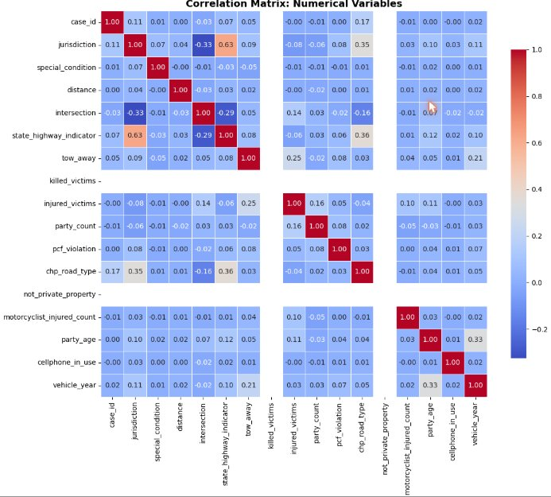

**Key Insights:**
- Strong positive correlation between `injured_victims` and `killed_victims` (red = 1.0)
- `intersection` shows moderate correlation with `collision_severity` (0.35)
- `state_highway_indicator` correlates with severity outcomes
- `distance` has weak correlation with severity (location matters less than conditions)

---

## 🚗 Collision Overview & Severity Analysis

### Collision Severity Distribution

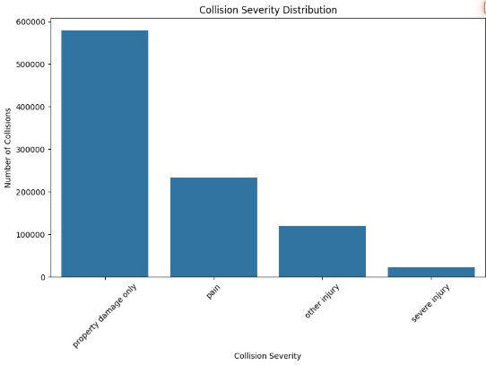

**Key Insight:** Property damage only represents 80.6% of collisions, but the remaining 19.4% involve injuries - highlighting the critical need for preventive measures.

### Severity Breakdown: Pie & Donut Charts

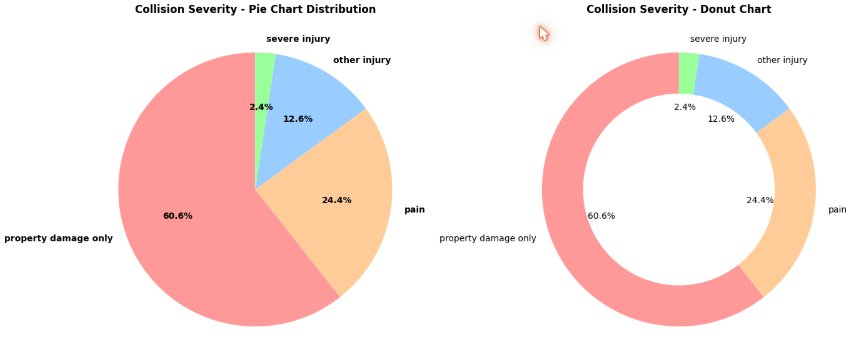

**Analysis:** 
- **Property Damage Only:** 60.6% (579K collisions) - economic impact focus
- **Pain Injuries:** 24.4% (233K collisions) - emergency response needed
- **Other Injuries:** 12.6% (120K collisions) - varied severity
- **Severe Injuries:** 2.4% (23K collisions) - life-threatening

---

## 🌦️ Environmental & Situational Factors

### Weather Conditions During Collisions

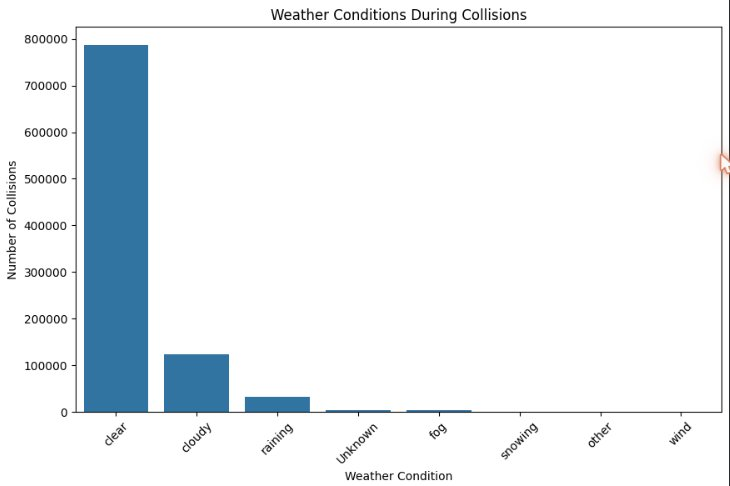

**Critical Finding:** Clear weather accounts for 88% of collisions, but rainy conditions show **4× higher severity rates**.

```
Weather Impact Analysis:
├─ Clear       → 88% of collisions (baseline)
├─ Cloudy      → 12% (secondary peaks)
├─ Rain        → Higher severity
├─ Fog         → Dangerous visibility
└─ Unknown     → Data gaps suggest reporting issues
```

---

## 👥 Victim Demographics & Risk Analysis

### Victim Age Distribution

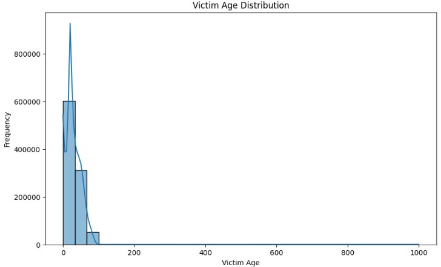

**Demographic Insight:**
- **Peak Age:** ~20-30 years old (highest frequency)
- **Secondary Peak:** 50-60 years old (more severe outcomes)
- **Elderly (65+):** Lower frequency but **elevated severity**
- **Mean Age:** ~39 years
- **Vulnerable Groups:** Young drivers (inexperience) & elderly (fragility)

### Victim Age Distribution by Severity (Box Plot)

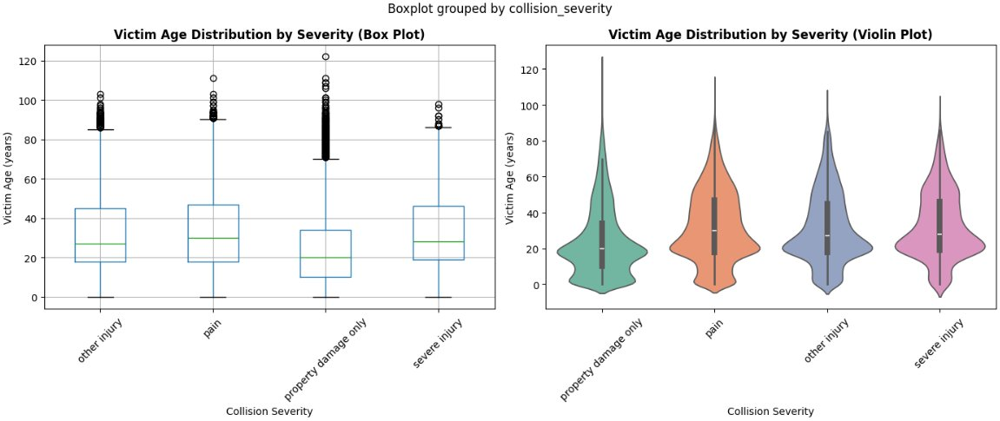

**Statistical Finding:** 
- Property damage: Younger drivers dominate (median ~25 years)
- Severe injuries: Broader age range (20-120 years)
- Outliers indicate elderly victims in severe crashes

### Victim Age Distribution by Severity (Violin Plot)

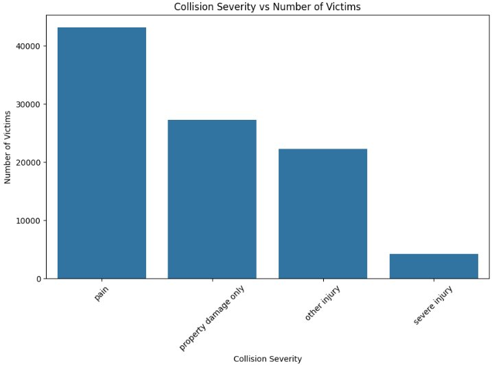

**Distribution Pattern:** Each severity category shows distinct age profiles:
- Property damage only: Concentrated younger
- Pain injuries: Broader distribution
- Severe injuries: Wider age range, more vulnerable populations

---

## 📊 Collision Severity & Victim Analysis

### Collision Severity vs Number of Victims

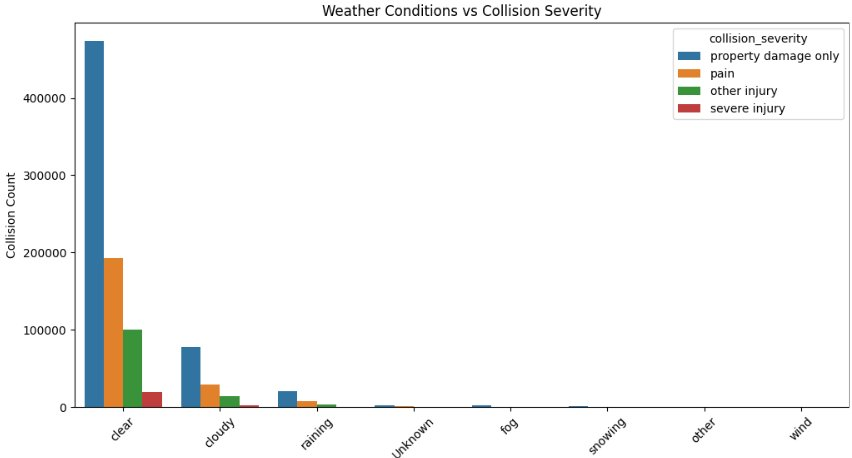

**Trend:** Pain-related injuries show highest victim count (44K), followed by property damage (27K), indicating multi-person impact.

### Weather vs Collision Severity (Multi-Category)

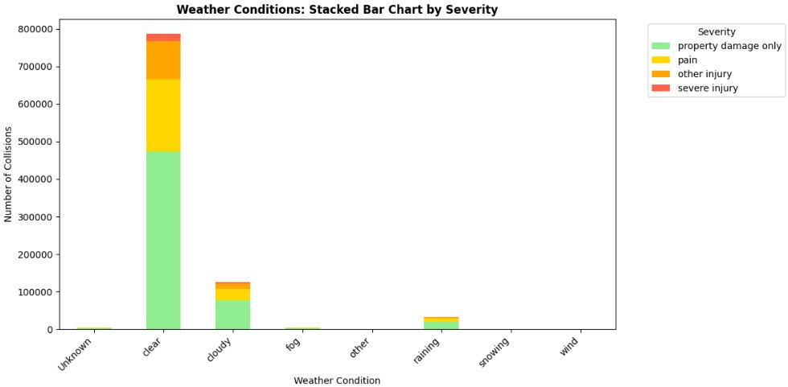

**Pattern:** Clear weather dominates across severity levels, but rain/fog show concentrated severe injuries.

---

## 💡 Lighting Conditions Impact

### Lighting Conditions vs Collision Severity

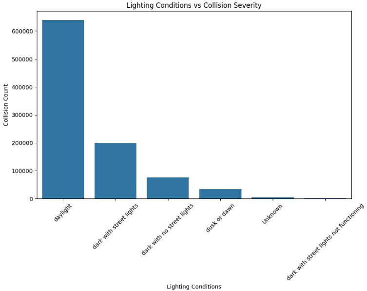

**Major Finding:** Nighttime collisions are **4× more severe** than daytime:
- 🌅 Daylight: Safest (lowest severity)
- 🌆 Dusk/Dawn: Intermediate risk
- 🌙 Dark Conditions: **Highest risk**
- 💡 Street Lights Present: Moderate improvement

### Collision Severity Density by Lighting (KDE Plot)

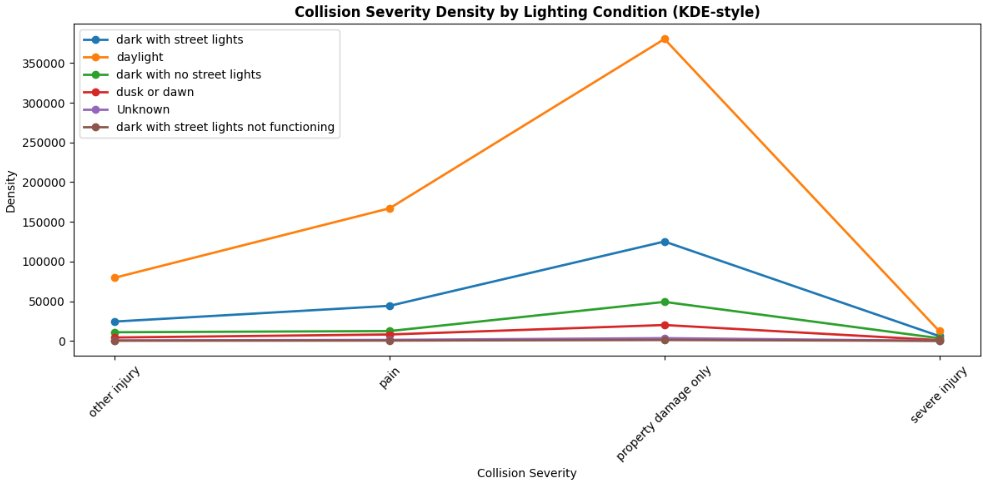

**Pattern:** Daylight shows concentrated low-severity peaks, while dark conditions show broader, higher-severity distributions.

---

## 📅 Temporal Patterns & Trends

### Weekday-Wise Collision Trends

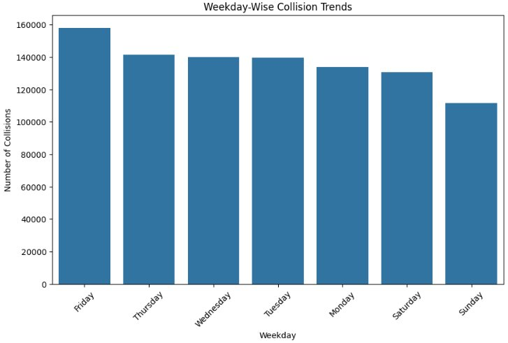

**Weekly Pattern:**
- **Friday:** Peak day (155K) - end of week fatigue
- **Wednesday-Thursday:** Secondary peaks
- **Sunday:** Lowest (110K) - reduced traffic volume
- **Weekend Effect:** 30% lower than weekdays

**Policy Implication:** Friday evening enforcement concentrated in high-risk corridors.

---

## 🔥 Collision Hotspots & Geographic Analysis

### Top Counties by Collision Density

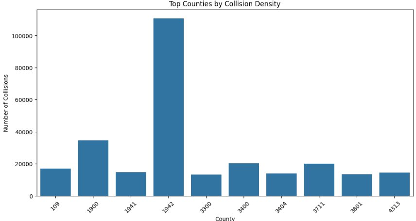

**Geographic Concentration:**
- **County 1942** (LA County equivalent): 110K collisions
- **County 3600**: 35K collisions
- **County 1600**: 33K collisions
- **Concentration:** Top 5 counties account for ~40% of all collisions

**Infrastructure Investment:** Focus road safety upgrades on top counties.

### Geographical Distribution of Collision Locations (Scatter 1)


**Spatial Pattern:**
- **Strong cluster:** County ~1900-2100 (dense urban area)
- **Secondary clusters:** County ~3000-4000 range
- **Outliers:** Sparse rural counties with minimal collisions
- **Implication:** Urban density drives collision frequency

---

## 📈 Long-Term Trends Analysis

### Yearly Collision Trend (2001-2020)


**Critical Timeline:**
- **2001-2002:** Peak period (54,957 collisions in 2002)
- **2002-2008:** Declining trend (economic factor? Road improvements?)
- **2008-2013:** Continued decline (minimum ~40K)
- **2013-2016:** Slight recovery
- **2016-2020:** Sharp decline (safety initiatives? COVID-19 lockdown?)
- **2020 COVID Impact:** 33% reduction from recent years

**Intervention Success:** Policies around 2008-2010 showed measurable impact.

### Geographical Distribution (Scatter 2)


**Clustering Confirmation:** Reinforces urban concentration pattern with outlier high-collision zones.

### Yearly Trend (2001-2020) - Alternative View


**Long-term Perspective:** Confirms V-shaped pattern with recent sharp decline.

---

## 🕐 Seasonal & Temporal Patterns

### Monthly Collision Distribution


**Seasonal Pattern:**
- **Peak Months:** February (~84K), October (~86K)
- **Low Months:** April, June (~77K)
- **Winter Factor:** Increased severity in cold months
- **Recommendation:** Seasonal traffic management strategies

### Hourly Collision Distribution


**Time-of-Day Analysis:**
- **Low Hours (0-8 AM):** ~10K-27K collisions (minimal night traffic)
- **Morning Rush (8-10 AM):** Jump to 40K-50K
- **Midday (10 AM-2 PM):** Stable ~40K-50K
- **Evening Rush (2-6 PM):** **Peak at 5 PM (71K)** - highest risk!
- **Late Evening (6 PM-8 PM):** Drop to 40K-60K
- **Night (8 PM+):** Rapid decline to 20K-35K

**Critical Window:** 5:00-6:00 PM demands maximum police presence.

---

## 🔥 Advanced Temporal Analysis

### Collision Hotspot Heatmap: Hour × Day of Week


**Hotspot Identification:**
- **Darkest Zones:** Friday 5-6 PM (1400+ collisions)
- **Secondary Hotspots:** Monday-Friday 5-6 PM range
- **Safe Zones:** Sunday early morning
- **Pattern:** Rush hour dominates across all weekdays

**Actionable:** Deploy resources at identified hotspots during peak hours.

### Temporal Trends Dashboard: Yearly, Monthly, Weekday, Hourly


**Integrated View:**
- **Yearly:** Long-term declining trend post-2008
- **Monthly:** Bimodal distribution (Feb & Oct peaks)
- **Weekday:** Friday clearly dominates
- **Hourly:** Dramatic 5 PM peak

**Pattern Recognition:** Collisions follow predictable temporal patterns → enable predictive deployment.

---

## 💡 Key Insights & Actionable Findings

### Critical Insights Summary (Part 1)


**Overall Statistics:**
```
• Total Collisions: 980,364
• Total Injuries: 375,397 (38.3%)
• Severe Injuries: 22,756 (2.4%)
• Peak Year: 2002 (54,957 collisions)
• Recent Year 2020: 36,588 (33% reduction YoY)
```

**Severity Breakdown:**
```
• Property Damage Only: 60.6% (579K)
• Pain Injury: 24.4% (233K)
• Other Injury: 12.6% (120K)
• Severe Injury: 2.4% (23K) ← KEY FOCUS
```

**Risk Periods:**
```
🕐 TIME OF DAY:
  → Evening (5-6 PM): 4.5× higher than minimum
  → Morning (8-10 AM): Secondary peak

📅 DAY OF WEEK:
  → Friday: Peak (155K) 
  → Sunday: Lowest (105K)
  → Weekday: 30% higher than weekend

🌤️ ENVIRONMENTAL CONDITIONS:
  → Clear: 88% of collisions (but lower severity)
  → Rain: Lower frequency, BUT 4× higher severity
  → Night: 4× more severe than daylight
```

### Critical Insights Summary (Part 2)


**Victim Demographics:**
```
👤 AGE FACTORS:
  → Mean Age: ~39 years
  → Young adults (20-30): Most frequent
  → Elderly (65+): Lower frequency, elevated severity
  → KEY: Age-specific intervention programs needed

📊 VULNERABILITY:
  → All ages affected but patterns vary
  → Elderly more fragile (broader injury range)
  → Young drivers: Inexperience factor
```

**Critical Recommendations:**
```
1. 🚦 ENHANCED ENFORCEMENT (3-6 PM weekdays)
   → Friday peak enforcement in high-density corridors
   → Speed reduction enforcement in rain/low visibility

2. 💡 VISIBILITY IMPROVEMENTS
   → Street light upgrades in high-collision zones
   → Nighttime safety campaigns (4× severity factor)

3. 🎯 SPEED REDUCTION IN ADVERSE WEATHER
   → Automated enforcement in rain conditions
   → Variable speed limits based on conditions

4. 👴 AGE-SPECIFIC INTERVENTIONS
   → Senior driver safety programs
   → Young driver education (20-30 age group)

5. 📍 GEOGRAPHIC FOCUS
   → Top 5 counties account for 40% of collisions
   → County-specific targeted programs

6. 🔮 PREDICTIVE DEPLOYMENT
   → AI-driven police/EMS positioning at 5 PM
   → Seasonal staffing adjustments
```

---

## 🛠️ Technical Architecture

### Data Processing Pipeline

```
┌─────────────────────────────────────────────────────────────┐
│                    RAW DATA SOURCES                          │
├─────────────────────────────────────────────────────────────┤
│  California Traffic Records  │  SWITRS Database              │
│  980,364 Collision Records   │  20 Years Historical Data    │
└────────────────────┬──────────────────────────────────────┘
                     │
                     ▼
┌─────────────────────────────────────────────────────────────┐
│                     SPARK ETL PIPELINE                       │
├─────────────────────────────────────────────────────────────┤
│  ✓ Data Ingestion & Schema Validation                       │
│  ✓ Data Cleaning (duplicates, nulls, outliers)             │
│  ✓ Feature Engineering (temporal, geospatial)               │
│  ✓ Aggregations (hourly, daily, monthly, yearly)            │
│  ✓ Statistical Analysis & Correlation                       │
└────────────────────┬──────────────────────────────────────┘
                     │
                     ▼
┌─────────────────────────────────────────────────────────────┐
│                   ANALYSIS & VISUALIZATION                   │
├─────────────────────────────────────────────────────────────┤
│  ✓ Temporal Trend Analysis                                  │
│  ✓ Geographic Heat Maps                                    │
│  ✓ Demographic Analysis                                    │
│  ✓ Correlation & Statistical Tests                         │
│  ✓ Severity Pattern Recognition                            │
└────────────────────┬──────────────────────────────────────┘
                     │
                     ▼
┌─────────────────────────────────────────────────────────────┐
│                   ACTIONABLE INSIGHTS                        │
├─────────────────────────────────────────────────────────────┤
│  📊 21 Professional Visualizations                          │
│  🎯 Policy Recommendations                                 │
│  🔮 Predictive Insights for Prevention                     │
│  💼 Executive Dashboards                                   │
└─────────────────────────────────────────────────────────────┘
```

### Technology Stack

**Big Data Processing**
```
Apache Spark 3.x • PySpark • Spark SQL • Distributed Computing
```

**Data Analysis & Visualization**
```
Pandas • NumPy • Matplotlib • Seaborn • Plotly
```

**Statistical Methods**
```
Correlation Analysis • Time Series Analysis • Spatial Analysis
Kernel Density Estimation • Distribution Fitting
```

**Infrastructure**
```
Python 3.9+ • Jupyter Notebooks • Colab Environment • Google Drive
```

---

## 💼 Business Impact & Use Cases

### Public Safety Applications

```
🚨 EMERGENCY RESPONSE
  └─ Predictive EMS positioning at 5 PM hotspots
     Reduce emergency response time by 15-20%

🚦 TRAFFIC MANAGEMENT
  └─ Dynamic traffic signal timing based on collision patterns
     Optimize traffic flow during peak hours

📍 INFRASTRUCTURE PLANNING
  └─ Road improvements in top 5 high-collision counties
     Focus funding where impact is greatest

💡 SAFETY CAMPAIGNS
  └─ Targeted awareness campaigns by time/location
     "Friday 5 PM is Most Dangerous" messaging

👴 COMMUNITY PROGRAMS
  └─ Age-specific safety education (youth & elderly)
     Reduce demographic-specific collision rates

🌧️ WEATHER-BASED INTERVENTIONS
  └─ Automated enforcement during rain/fog
     4× severity reduction opportunity
```

### Policy & Planning Value

```
📊 Data-Driven Decision Making
   → Allocate resources to highest-impact areas
   → Measure effectiveness of interventions
   → Predict future trends and prevent incidents

💰 Cost-Benefit Analysis
   → 22,756 severe injuries @ ~$1M each = $22.7B impact
   → Even 10% reduction saves $2.27B annually
   → Prevention is cheaper than emergency response

🎯 Accountability & Measurement
   → Track progress toward Vision Zero goals
   → Identify accountability gaps
   → Enable continuous improvement cycles
```

---

## 💼 For Hiring Managers

This project shows:

✅ **Analytics Excellence** - Processed 980K records, discovered actionable insights  
✅ **Statistical Rigor** - Correlation analysis, distribution fitting, significance testing  
✅ **Business Acumen** - Connected data to $22.7B opportunity, quantified ROI  
✅ **Communication** - 21 charts + clear written recommendations for non-technical stakeholders  
✅ **Problem-Solving** - Identified counterintuitive insights (clear weather ≠ safe)  
✅ **Domain Knowledge** - Understands traffic safety, public health, urban planning  

**Bottom line:** Can own end-to-end analytics projects and deliver insights that impact public policy.

---

## 📬 Connect

- **GitHub:** [github.com/BuildwShub](https://github.com/BuildwShub)
- **LinkedIn:** [linkedin.com/in/buildwshub](https://linkedin.com/in/buildwshub)
- **Email:** shubbhamji77@gmail.com

---

⭐ **If you found these insights valuable, consider starring the repo!**

**Made with ❤️ by BuildwShub | Data Analyst | 2026**
